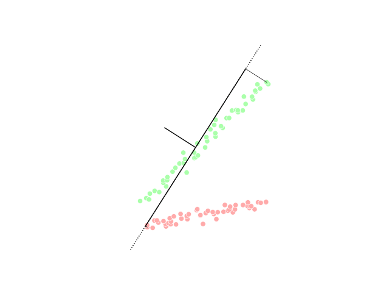

# Week 1
## Introductions
- What is AI?
- What is a Tokenzier?
- What is an Large Language Model?
- What is Encoding?
- What is Decoding?
## Tokenizers : It's all about the tokens

_what is a tokenizer?_

Tokenizers break up _words_, _parts of words_ and _phrases_ into a unique token that the software can recognize.  

Some tokenizers work by splitting up a sentence or phrase based of the spaces between words but some tokenizers take a more machine centered approach and split them up by bytes.


In the computer world everything is made of of bits and bytes. Have you heard of the phrase Megabits and Megabytes.  Some people would want you to believe they are the same thing but they aren't. 

- a _bit_ is a single binary number a 0 or a 1
- a _byte_ is made up of 8 _bits_

The difference between a megabit and a megabyte is 7 million bits. 

The way a byte level tokenizer works is that it splits up a sentence or a phrase or a paragraph by the individual bytes.  If a word is really long it takes up more bytes in memory therefore it has more tokens.  

Lets look at how a tokenizer works by looking at the openAI GPT3 tokenizer and feed it some phrases: [link](https://platform.openai.com/tokenizer)


If we turn on show _token id_ we can see the unique identifier for each word in the GPT3 tokenizer.


Let run the word _somewhere_ through the system.  Some would assume that it would have a single unique identifier. But it doesn't!


As you can see the word is actually 3 different tokens. the letter _s_ the suffix _ome_ and the word _here_

Let look at this diagram for the steps for feeding a phrase into a tokenizer and then into a model.


The goal of tokenizers is to transform natural language into something a computer can understand and perform math operations on:


So these bit of code

```
raw_inputs = [
    "I've been waiting for this blog my whole life.",
    "I hate this so much!",
]
inputs = tokenizer(raw_inputs, padding=True, truncation=True, return_tensors="tf")
```

will turn the phrases:

- _"I've been waiting for this blog my whole life."_
- _"I hate this so much!"_

into this Tensor that the computer can understand

```
{
    'input_ids': <tf.Tensor: shape=(2, 16), dtype=int32, numpy=
        array([
            [  101,  1045,  1005,  2310,  2042,  3403,  2005,  1037, 17662, 12172,  2607,  2026,  2878,  2166,  1012,   102],
            [  101,  1045,  5223,  2023,  2061,  2172,   999,   102,     0,     0,     0,     0,     0,     0,     0,     0]
        ], dtype=int32)>, 
    'attention_mask': <tf.Tensor: shape=(2, 16), dtype=int32, numpy=
        array([
            [1, 1, 1, 1, 1, 1, 1, 1, 1, 1, 1, 1, 1, 1, 1, 1],
            [1, 1, 1, 1, 1, 1, 1, 0, 0, 0, 0, 0, 0, 0, 0, 0]
        ], dtype=int32)>
}
```

### What does this all Mean?

I know there is a lot to unpack in the above snippet and we won't get into that yet.  You're probably confused and wondering why I'm telling you all of this, but it will make sense shortly.

Lets look at phone numbers!

(Country Code)-(Area Code)-(Exchange)-(Extension)

so something like:

+1-917-XXX-XXXX

_this is when I give you my cell phone number for emergencies only_ 

So if you think about a phone number here in the states, it is a set of eleven numbers that make up 4 different tokens, the country code is a unique token to everyone in the States, the area code is unique token to everyone in that area, the exchange is a unique token to everyone in that exchange, and the last four digits, is your extension token in the exchange in the area code in the country code.  So that when you put those eleven digits in the correct order, it create a unique address to your phone.  

For generative AI think about this tokens as the parts that make up the address of the output you want.  It's a multi-dimensional location inside the latent space of the network.

### _DAN! WTF IS LATENT SPACE???_


Latent Space is the multi-dimensional space that makes up the 'knowledge' of Generative AI. 

Think of it as a complex space where each unique item is nearby similar items. In the figure above we see all of the items of the same color grouped together.  But because it is more than 3 dimensions (its just represented in 3 dimensions here) some of the blue dots could contain information that is similar to the pink dots and are close to them as well on that 4th, 5th, or Nth dimension. 

Sometimes we project it down to 2D space with a dimensional reduction step to make it easier to see


_DAN! WTF IS DIMENSIONAL REDUCTION??_

Dimensional reduction is a technique used to reduce the number of features in a dataset while retaining as much of the important information as possible

You can see here when we project this representation of latent space down to 2D some of the red dots are mixed in with the green dots, that is because they contain similar data points and should be near each other



### Putting it all together

 Each type of generative AI has its own unique tokenizer (or well a lot of them use the same one lol) that translates the natural language prompts you supply into an array of numbers that represent the _address_ of what you are looking for inside the _model_ of the generative AI.  This address is a unique identifier for a location inside the latent space of the AI model's _knowledge_ of what it has been trained on. 
- BERT
- ROBERTA
- Llama
- BPE


## Prompt Engineering 101
Prompting  

So all of these prompts will give me different results because they describe the image I want differently:

```a poster of a black and white hightop sneaker, nike air jordan 1```


```a black and white photo of an nike air jordan 1 poster```


```a hightop nike air jordan 1, black and white, poster```


You can see how building on top of a prompt can narrow your search to what you are looking for in the AI Mines:

```a poster of a black and white nike air jordan 1 hightop sneaker```


```a poster of a black and white nike air jordan 1 hightop sneaker, product shot, wide angle, on foot```


```a poster of a black and white nike air jordan 1 hightop sneaker, product shot, wide angle, on foot, pink background, high res, studio lighting```


Each of these prompts narrows your search inside the latent space to reveal what you are looking for. 

So lets look at some rules:
### Key Phrases and Constraints 

What is the difference between these two statements:

  ```Please give me the history of the united states```

  ```Please give me the history of the united states in 3 sentences```

### Chain-of-Thought

_Make it a run on sentence that describes everything in detail_

```write a short story about the time my friend jack and I went over the hill and through the woods to find a rocket in a secret cave that was a government army base that was 13 stories deep but jack fell at the opening of the cave I had to save him and We escaped with the Alien```

### ChatGPT-3.5(ish)

_Over the Hill and Through the Woods: A Journey to the Secret Cave_

_Once upon a time, in a small town nestled between rolling hills and dense woods, lived two adventurous friends, Jack and the storyteller. Their curious hearts were always seeking excitement and thrill, and one sunny morning, they stumbled upon a mysterious map tucked away in the attic of an old abandoned house. The map revealed the location of a secret cave, rumored to hold a hidden rocket and the entrance to a government army base buried 13 stories deep underground._

_Eyes wide with wonder, Jack and the storyteller decided to embark on an unforgettable journey to uncover the secrets of the cave. With the map clutched tightly in their hands, they set off over the hill and through the woods, the beauty of nature surrounding them._

_As they trudged through the undergrowth, Jack's excitement was infectious. He spoke of flying to the stars in the rocket, exploring new galaxies, and making friends with extraterrestrial beings. The storyteller couldn't help but catch his friend's enthusiasm, their dreams intertwining like vines in the forest._

_As the sun began its descent, casting long shadows across the landscape, they finally reached the foot of the hill where the cave's entrance lay hidden. The cave's mouth was dark and foreboding, but Jack's enthusiasm knew no bounds. He rushed ahead, and in his eagerness, he stumbled and fell hard, gasping in pain as he clutched his ankle._

_Worry and fear etched on the storyteller's face, they rushed to Jack's side. He couldn't walk, and the cave's secrets seemed even more elusive than ever. But the storyteller was determined not to let their adventure end in disappointment._

_With grit and determination, the storyteller helped Jack up, and with his arm around his friend's shoulder, they hobbled into the cave together. As they descended, the darkness engulfed them, and the air grew colder, but the faint sound of mechanical hums reassured them they were on the right path._

_At last, they reached the 13th floor, where they encountered the true wonders hidden within the cave. It wasn't just a rocket; it was an advanced spacecraft of extraterrestrial origin, left behind by an alien race that had visited Earth long ago. The government had been studying it secretly for years._

_Amidst the alien technology, Jack and the storyteller made a startling discovery. A friendly alien creature, small and shimmering, had been left behind, trapped in the cave for decades. It communicated with them through a series of mesmerizing colors and gentle hums, and despite their initial shock, they soon felt a profound connection with the being._

_As they marveled at the wonders before them, they also stumbled upon confidential files detailing the government's secret experiments. Feeling a sense of responsibility, Jack and the storyteller decided to share this information with the world, believing that such advanced technology and knowledge should be used for the betterment of humankind, not hidden away in secrecy._

_But their noble intentions put them in danger. The government discovered their presence and began to hunt them down. With the alien's help, they navigated through the twists and turns of the secret cave and made their escape, just barely evading capture._

_With the alien now by their side, they returned to their small town, determined to protect their new friend and ensure the world knew the truth about the secrets hidden beneath the hill and through the woods._

_From that day forward, Jack and the storyteller became local legends. Their friendship and bravery were admired, and their tale of the alien in the secret cave sparked debates and discussions across the world. But they remained humble, knowing that the real heroes were the ones who dared to seek the unknown and stand up for what they believed in._

_And so, their adventure left an indelible mark on their hearts and minds, reminding them that the most extraordinary things often lie just over the hill and through the woods._


### [Mixtral-8x7B](https://catalog.ngc.nvidia.com/orgs/nvidia/teams/ai-foundation/models/mixtral-8x7b)

_Once upon a time, my friend Jack and I were avid explorers, always on the lookout for our next big adventure. One day, we heard rumors of a secret government army base hidden deep within a cave in the woods. The base was said to be 13 stories deep and guarded by the most advanced security systems in the world. But the most intriguing part was the rumor of an alien spacecraft that was being studied in the base._

_Jack and I were skeptical at first, but our curiosity got the better of us. We packed our bags and set off on our journey, hiking over the hill and through the woods until we reached the entrance of the cave. The opening was narrow and treacherous, but we were determined to find out if the rumors were true._

_As we made our way deeper into the cave, the air grew colder and the walls grew narrower. We had to crawl on our hands and knees, but we finally reached the bottom level of the base. And there it was, the alien spacecraft, just as the rumors had said._

_We approached the spacecraft with caution, taking in every detail of its strange and otherworldly design. But just as we were about to get a closer look, Jack lost his footing and fell to the ground. He let out a loud cry of pain, and I knew immediately that something was wrong._

_I rushed to Jack's side and saw that he had twisted his ankle. He was in agony and unable to move. I knew we had to get out of there fast, but I couldn't leave Jack behind. I fashioned a makeshift splint out of some nearby branches and helped Jack to his feet._

_Together, we made our way back to the cave entrance, with me supporting Jack every step of the way. But just as we were about to reach the surface, we were confronted by a group of government soldiers. They demanded to know what we were doing in the base and ordered us to surrender._

_But Jack and I had come too far to give up now. We made a break for it, running as fast as we could towards the cave entrance. The soldiers gave chase, but we were too quick for them. We emerged from the cave and into the safety of the woods, with the alien spacecraft in tow._

_We had done it. We had found the secret government army base and escaped with the alien spacecraft. It was an adventure we would never forget, and one that brought Jack and I even closer together as friends._


### Show Me Your Prompts

```surreal image of George Bush and Obama kissing under the mistletoe dali, banksy, street art``` 


```surreal image of George Bush and Obama kissing under the mistletoe dali, banksy, street art, beeple```


```surreal image of George Bush and Obama kissing under the mistletoe dali, banksy, street art, beeple, vaporwave, synthwave, pink and purple background```


```surreal image of George Bush and Obama kissing under the mistletoe dali, banksy, street art, beeple, vaporwave, synthwave, blue, pink and purple background```


```surreal image of George Bush and Obama kissing under the mistletoe at christmas in the white house dali, banksy, street art, beeple, vaporwave, synthwave, blue, pink and purple background, wide angle, yellow background```


## Order and Context is Important

Lets try these out: (I haven't tried these prompt we're going in cold)

```surreal painting of George Bush and Obama kissing under the mistletoe on the white house lawn```


```surreal oil painting by Dali of George Bush and Obama kissing under the mistletoe on the white house lawn```


```a paparazzi photo of George Bush and Obama caught kissing on the lips under the mistletoe on the white house balcony, TMZ```


```photo of Street art on the side of a building by the street artist banksy of Bush and Obama kissing on the lips, spray paint```


```stencil art by the street artist banksy of George Bush and Obama kissing on the lips, black and white, street photography, street art, black and white```


```a black and white photo of George Bush and Obama kissing on the lips in the oval office at christmas time```


```a christmas card from Obama featuring Obama kissing George Bush on the lips```


```a pile of christmas cards on a table with the top christmas card being from Obama featuring Obama kissing Bush on the lips```


### My Simple Rules to Follow

```[output] [subject] [context] [style modifiers]```

```[subject] [context] [style modifiers]```

```[constraints] [subject] [context] [style modifiers]```

```[subject] [context] [style modifiers] [constraints]```

## BREAK

## Transformer Models 

_What Are Transformers?_


- Image Classification
- Audio Classification
- Language Translation
- ChatGPT (GPT-3.5, GPT-4.0)
- Llama
- Mixtral-8x-7B

A transformer model is a type of deep learning model that was introduced in 2017. These models have quickly become fundamental in natural language processing (NLP), and have been applied to a wide range of tasks in machine learning and artificial intelligence.

The model was first described in a 2017 paper called "Attention is All You Need" by Ashish Vaswani, a team at Google Brain, and a group from the University of Toronto. The release of this paper is considered a watershed moment in the field, given how widespread transformers are now used in applications such as training LLMs.

The key innovation of the transformer model is not having to rely on recurrent neural networks (RNNs) or convolutional neural networks (CNNs), neural network approaches which have significant drawbacks. Transformers process input sequences in parallel, making it highly efficient for training and inference — because you can’t just speed things up by adding more GPUs. Transformer models need less training time than previous recurrent neural network architectures such as long short-term memory (LSTM).

RNNs and LSTM date back to the 1920s and 1990s, respectively. These techniques compute each component of an input in sequence (e.g. word by word), so computation can take a long time. What’s more, both approaches run into limitations in retaining context when the “distance” between pieces of information in an input is long.

There are two primary innovations that transformer models bring to the table. Consider these two innovations within the context of predicting text.

- Positional encoding: Instead of looking at each word in the order that it appears in a sentence, a unique number is assigned to each word. This provides information about the position of each token (parts of the input such as words or subword pieces in NLP) in the sequence, allowing the model to consider the sequence's sequential information.

- Self-attention: Attention is a mechanism that calculates weights for every word in a sentence as they relate to every other word in the sentence, so the model can predict words which are likely to be used in sequence. This understanding is learned over time as a model is trained on lots of data. The self-attention mechanism allows each word to attend to every other word in the sequence in parallel, weighing their importance for the current token. In this way, it can be said that machine learning models can “learn” the rules of grammar, based on statistical probabilities of how words are typically used in language.

### How do transformer models work?
Transformer models work by processing input data, which can be sequences of tokens or other structured data, through a series of layers that contain self-attention mechanisms and feedforward neural networks. The core idea behind how transformer models work can be broken down into several key steps.

Let’s imagine that you need to convert an English sentence into French. These are the steps you’d need to take to accomplish this task with a transformer model.

- Input embeddings: The input sentence is first transformed into numerical representations called embeddings. These capture the semantic meaning of the tokens in the input sequence. For sequences of words, these embeddings can be learned during training or obtained from pre-trained word embeddings.

- Positional encoding: Positional encoding is typically introduced as a set of additional values or vectors that are added to the token embeddings before feeding them into the transformer model. These positional encodings have specific patterns that encode the position information.

- Multi-head attention: Self-attention operates in multiple "attention heads" to capture different types of relationships between tokens. Softmax functions, a type of activation function, are used to calculate attention weights in the self-attention mechanism.

- Layer normalization and residual connections: The model uses layer normalization and residual connections to stabilize and speed up training.

- Feedforward neural networks: The output of the self-attention layer is passed through feedforward layers. These networks apply non-linear transformations to the token representations, allowing the model to capture complex patterns and relationships in the data.

- Stacked layers: Transformers typically consist of multiple layers stacked on top of each other. Each layer processes the output of the previous layer, gradually refining the representations. Stacking multiple layers enables the model to capture hierarchical and abstract features in the data.

- Output layer: In sequence-to-sequence tasks like neural machine translation, a separate decoder module can be added on top of the encoder to generate the output sequence.

- Training: Transformer models are trained using supervised learning, where they learn to minimize a loss function that quantifies the difference between the model's predictions and the ground truth for the given task. Training typically involves optimization techniques like Adam or stochastic gradient descent (SGD).

- Inference: After training, the model can be used for inference on new data. During inference, the input sequence is passed through the pre-trained model, and the model generates predictions or representations for the given task.

## BREAK

## Setting Up a Development Environment an introduction to Google Collab

- Useful Links for your Assignments
    - [Stable Diffusion WebUI Colab](https://github.com/camenduru/stable-diffusion-webui-colab)
 

# For Next Week:
## Reading List
- [Scrapism A Manifesto](./readings/Scrapism-A-Manifesto.pdf)
- [A Radical Plan to make AI Good, Not Evil](./readings/anthropic-ai-chatbots-ethics.pdf)
Each Reading Response is due the Thursday before class @ 8:30 pm

### How To Submit a Reading Response
1. Open Google Docs
2. Name Google Docs lastName_firstName_digitalCurrents_ss24
3. share that Doc with moored1@newschool.edu
4. Write one 150-250 Paragraph about the reading, it could be about anything at all. 
## Bring 3-5 Concepts for your AI Book.
