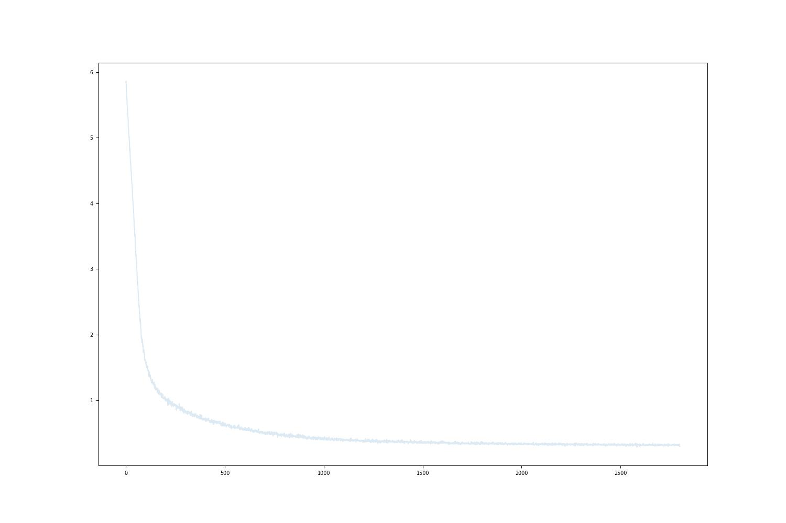

# Week 3 Creating

## Gut Check 
- How are y'all doing?
- Are you learning things?
- What could I change for next time?
- How are your books coming along?

## Homework Presentations 

### [Taking Raw Data to Training with Mistral-7B](./notebooks/3_Finetuning_Mistral-7B.ipynb)

[Mistral-7B](https://huggingface.co/mistralai/Mistral-7B-v0.1) by Mistral AI.  Mistral AI is a French company in artificial intelligence. It was founded in April 2023 by researchers previously employed by Meta and Google DeepMind: Arthur Mensch, Timothée Lacroix and Guillaume Lample.

Mistral-7B is a 7.3B parameter language model using the transformers architecture. Mistral 7B uses a similar architecture to LLaMA, but with some changes to the attention mechanism. In particular it uses Grouped-query attention (GQA) intended for faster inference and Sliding Window Attention (SWA) intended to handle longer sequences.

Sliding Window Attention (SWA) reduces the computational cost and memory requirement for longer sequences. In sliding window attention, each token can only attend to a fixed number of tokens from the previous layer in a "sliding window" of 4096 tokens, with a total context length of 32768 tokens. At inference time, this reduces the cache availability, leading to higher latency and smaller throughput. To alleviate this issue, Mistral 7B uses a rolling buffer cache.

[Mistral-8x7B](https://huggingface.co/mistralai/Mixtral-8x7B-v0.1) is a high-quality sparse mixture of experts model (SMoE) with open weights.  

Mistral-8x7B has the following capabilities:
- It gracefully handles a context of 32k tokens.
- It handles English, French, Italian, German and Spanish.
- It shows strong performance in code generation.
- It can be fine-tuned into an instruction-following model that achieves a score of 8.3 on MT-Bench.

The [Mistral-7B-Instruct-v0.2](https://huggingface.co/mistralai/Mistral-7B-Instruct-v0.2) Large Language Model (LLM) is an improved instruct fine-tuned version of Mistral-7B-Instruct-v0.1.


Instruction format
In order to leverage instruction fine-tuning, your prompt should be surrounded by ```[INST]``` and ```[/INST]``` tokens. The very first instruction should begin with a begin of sentence id. The next instructions should not. The assistant generation will be ended by the end-of-sentence token id.

```
text = "<s>[INST] What is your favourite condiment? [/INST]"
"Well, I'm quite partial to a good squeeze of fresh lemon juice. It adds just the right amount of zesty flavour to whatever I'm cooking up in the kitchen!</s> "
"[INST] Do you have mayonnaise recipes? [/INST]"
```

This format is available as a chat template via the apply_chat_template() method:

```
from transformers import AutoModelForCausalLM, AutoTokenizer

device = "cuda" # the device to load the model onto

model = AutoModelForCausalLM.from_pretrained("mistralai/Mistral-7B-Instruct-v0.2")
tokenizer = AutoTokenizer.from_pretrained("mistralai/Mistral-7B-Instruct-v0.2")

messages = [
    {"role": "user", "content": "What is your favourite condiment?"},
    {"role": "assistant", "content": "Well, I'm quite partial to a good squeeze of fresh lemon juice. It adds just the right amount of zesty flavour to whatever I'm cooking up in the kitchen!"},
    {"role": "user", "content": "Do you have mayonnaise recipes?"}
]

encodeds = tokenizer.apply_chat_template(messages, return_tensors="pt")

model_inputs = encodeds.to(device)
model.to(device)

generated_ids = model.generate(model_inputs, max_new_tokens=1000, do_sample=True)
decoded = tokenizer.batch_decode(generated_ids)
print(decoded[0])
```

[Notebook](./notebooks/3_Finetuning_Mistral-7B.ipynb)

#### [Graph your Loss](./notebooks/loss.ipynb) 

Graphing your loss as you train is a very important thing.  Loss is the computed percentage of how much the output differs from the input when given an atom. You want your loss to approach 0.0 but never get there.  You always want it going down.  

 

[Graph your Loss Notebook](./notebooks/loss.ipynb)

### [Fine Tuning Structured data with Phi-2](./notebooks/3_Finetuning_Phi-2.ipynb)

Some researcher have experimented with training transformers with Structured Data. A team at Microsoft Research has released a suite of small language models (SLMs) called “Phi” that achieve remarkable performance on a variety of benchmarks. Their first model, the 1.3 billion parameter Phi-1, achieved state-of-the-art performance on Python coding.  They then extended their focus to common sense reasoning and language understanding and created a new 1.3 billion parameter model named Phi-1.5, with performance comparable to models 5x larger. They recently released Phi-2, a 2.7 billion-parameter language model that demonstrates outstanding reasoning and language understanding capabilities, showcasing state-of-the-art performance among base language models with less than 13 billion parameters. On complex benchmarks Phi-2 matches or outperforms models up to 25x larger, thanks to new innovations in model scaling and training data curation. [Link](https://www.microsoft.com/en-us/research/blog/phi-2-the-surprising-power-of-small-language-models/)

  - Phi-2 QLoRa
    - [Phinetuning](https://medium.com/@geronimo7/phinetuning-2-0-28a2be6de110)
    - [Github](https://github.com/geronimi73/phi2-finetune/tree/main)
    - [phi2-finetune](./notebooks/phi2-finetune/README.md)


# Making ART with AI

### Physical Objects
- [_airgan_](http://aire-gan.com)
  - _*airegan_ is a series of works which examines the notion of form and design in sneaker culture. It plays with the notion of creator, tool and prior art.  The work further reflects  the paradigm shift in how we design objects of significance and authorship.
- [_Il papa col strozzapreti_](https://docs.google.com/presentation/d/1F8Znplt-WaNAtGPl_7e7EIc0Jtl5BqntVIhThdWrxPs/edit?usp=sharing) 
  - Il papa col strozzapreti presents an exploration of the ethical quandaries surrounding data collection for the training of artificial intelligence models. Employing a range of evocative imagery, including the striking figure of the Pope consuming strozzapreti, or "the priest strangler," pasta, the series delves deeply into the complex considerations surrounding the creation of AI.
- [Sougwen Chung](https://sougwen.com/artworks)
  - Chung's work investigates the interactions between mark-made-by-hand and the mark- made-by-machine as an approach to understanding the dynamics of humans and systems.
  - Chung's work treats ‘AI’ as a space of, and for, doubt and uncertainty rather than narrowly defined ends, creating works that address separation, merging, and how we inhabit the relations between human, machine and non-human others.

### Words
- [_REPETAE_ by Sasha Stiles](https://objkt.com/collections/KT1WGNjQmFft4GZK5UHy58nkFxecXjfEdqqr)
  - An ongoing series that uses visual poetics, AI-powered text, and generative code to explore how, in poetry as in art and life, meaning accrues through repetition. In particular, the project investigates resonances between poetic repetition and algorithmic recursion, and how emotion is unlocked via the development and interruption of pattern.
- [_BIBLIO-TECH_ by Sasha Stiles](https://objkt.com/collections/KT1AYpXcS8k9y3CbEpo3cukptgsR6sdyDRj2)
  - A fantasy library and writing studio, comprised of rare books, minted matter and poetic devices, from antiquity to futurity. Created using text-to-image AI tools in an exploration of the evolution of language, and the resonance between AI systems and libraries, from personal to public, as repositories for world knowledge and human wisdom.
  
### Tokenizer LLM Poetry (activity)
1) Use an LLM to generate 25 haiku
2) Tokenize the 25 haiku with a custom or different Tokenizer 
3) Procedurally Modify the tokens by some transform and decode them using the same Tokenizer you encoded them with
4) Take the Original Tokens and decode them with a different Tokenizer, could be a found one or custom trained one
5) Explore translating the original 25 haiku into the vocabulary of other LLMs

## Creating with LLMs
- Stories
- Artist Statements
- Critical Essays about your work
- Reviews of your work as if they are written by a famous critic 

## Generating and Evaluating your Custom LLMs

[Calculating The Probabilities of Tokens](./notebooks/5_Evaluating_Phi-2.ipynb)
  
# Reading List
- [The Case for Outsourcing Morality to AI](./readings/philosophy-artificial-intelligence-responsibility-gap.pdf)
- [A Radical Plan to make AI Good, Not Evil](./readings/anthropic-ai-chatbots-ethics.pdf)
- [Great promise but potential for peril](./readings/ethical-concerns-mount-as-ai-takes-bigger-decision-making-role.pdf)
- [The impact of artificial intelligence on human society and bioethics](./readings/TCMJ-32-339.pdf)